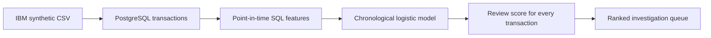

# Financial Crime Investigation & Transaction Risk System

## Completed version

PostgreSQL and machine-learning investigation pipeline across **5,078,345 synthetic transactions**. The database contains **5,177 simulated-laundering labels (0.1019%)** over September 1–18, 2022. Every transaction receives a model review score for case ranking.

The business question is: which transaction patterns merit closer investigation? Eight reproducible analyses cover size, label balance, data quality, currency-specific amounts, payment methods, outgoing account volume, hourly activity, and payments relative to strictly earlier account history.

The chronological logistic baseline was trained on dates before September 8 and tested on September 9 onward. In the later test period, its top 1,000 transactions contained **199 of 1,611** positive labels: **19.9% Precision@1,000**, **12.35% Recall@1,000**, and **0.1016 PR-AUC**. Test prevalence was 0.1865%, giving about 107× enrichment at K=1,000 within this synthetic test period.

See the [model report](reports/model_report.md), [raw model metrics](reports/model_metrics.json), [findings](docs/findings.md), [resume and LinkedIn text](docs/career.md), and [interview guide](docs/interview.md).



### Reproduce the SQL version

Requirements: PostgreSQL 16 and the source `HI-Small_Trans.csv` in `data/raw/`. Run from the repository root with PostgreSQL's `createdb` and `psql` commands on your `PATH`. The dataset is not included; see [Obtain the data](#2-obtain-the-data) below.

For a NEW database only:

```sh
createdb financial_crime
psql -X -v ON_ERROR_STOP=1 -d financial_crime -f sql/schema.sql
psql -X -v ON_ERROR_STOP=1 -d financial_crime -f sql/load.sql
```

Skip database creation and loading if you have already imported the data. The loader refuses to import into a populated table to prevent duplicate ingestion.

Generate the report:

```sh
psql -X -v ON_ERROR_STOP=1 -d financial_crime -f sql/investigation.sql -o reports/sql_findings.txt
```

Build features, train, score every transaction, and load the scores:

```sh
psql -X -v ON_ERROR_STOP=1 -d financial_crime -f sql/model_features.sql
psql -X -v ON_ERROR_STOP=1 -d financial_crime -c "\copy model_features TO 'data/processed/model_features.csv' WITH (FORMAT csv, HEADER true)"
python src/financial_crime/train_model.py
psql -X -v ON_ERROR_STOP=1 -d financial_crime -f sql/model_scores.sql
```

The model processes the CSV in chunks. Model artifacts and large generated files stay local and are excluded from Git.

### Design choices and limitations

- Account identity uses both bank and account code. Codes are text to preserve leading zeros.
- Amounts are grouped by currency. Transaction volume is not verified loss or unique financial exposure.
- Timestamps have no supplied timezone. Do not assume UTC.
- The current table stores amounts to two decimal places; further currency-specific precision validation is needed before broader use.
- The historical amount comparison uses only earlier calendar days and requires ten prior payments. This is an exploratory history rule, not a validated alert threshold. Accounts without sufficient history are omitted.
- Full-period totals and hourly counts describe the observed data. Rebuild them as of scoring time before using them in a model.
- Labels are the training target and evaluation answer key; they are never model inputs.
- `review_score` orders cases but is not a calibrated probability of crime. Class weighting intentionally changes calibration.
- Predicting 0 everywhere would achieve about 99.8981% accuracy and find no positive cases, so evaluation uses PR-AUC and top-K metrics.
- Later test dates have a higher positive rate than training dates. Results measure this synthetic time split and do not establish real-world performance.

### Next milestones

Add per-case feature contributions, validate a configurable exposure-aware priority rule, and build a Power BI investigation dashboard.

## Optional Python data profiling

The Python profiler below is an early exploration helper. The SQL report linked above is the authoritative V1 output. The three-row test fixture is fabricated test data and is not used for project metrics.

### 1. Create a Python environment

```bash
python3 -m venv .venv
source .venv/bin/activate
python -m pip install --upgrade pip
python -m pip install -e ".[dev]"
```

### 2. Obtain the data

The official [IBM AML-Data repository](https://github.com/IBM/AML-Data) points to an improved Kaggle distribution and the original IBM Box distribution. The transaction data is synthetic CSV data with a laundering tag; the data itself uses the CDLA-Sharing-1.0 licence, so read that licence before use.

Recommended: download a **small, documented Kaggle variant first** from [IBM Transactions for Anti Money Laundering (AML)](https://www.kaggle.com/datasets/ealtman2019/ibm-transactions-for-anti-money-laundering-aml). Place the selected transaction CSV under `data/raw/`. Do not commit it.

If you use the Kaggle CLI after installing and authenticating it, first inspect the dataset files:

```bash
python -m pip install kaggle
# Create a Kaggle API token at https://www.kaggle.com/settings/account,
# then place the downloaded kaggle.json in ~/.kaggle/kaggle.json and run:
chmod 600 ~/.kaggle/kaggle.json
kaggle datasets list -s "IBM Transactions for Anti Money Laundering"
kaggle datasets files ealtman2019/ibm-transactions-for-anti-money-laundering-aml
kaggle datasets download ealtman2019/ibm-transactions-for-anti-money-laundering-aml --path data/raw --unzip
find data/raw -type f
```

Alternatively, use the source links in the official repository and save the downloaded CSV in `data/raw/`.

### 3. Profile the real schema

Run this command with the actual file name shown by `find`:

```bash
python scripts/profile_dataset.py data/raw/YOUR_TRANSACTION_FILE.csv
```

For a very large CSV, get a quick first profile without loading the whole file:

```bash
python scripts/profile_dataset.py data/raw/YOUR_TRANSACTION_FILE.csv --sample-rows 500000
```

The factual report is written to `reports/dataset_profile.md`. It includes row count (or sampled row count), field names, inferred pandas types, missingness, cardinality, label distribution when detected, and amount statistics when detected.

## Source-to-table mapping

The two source columns named `Account` map to `from_account` and `to_account`. All eleven source columns are loaded in CSV order; PostgreSQL adds a generated `transaction_id`. The schema is saved in `sql/schema.sql`. The ID is a local identifier, not supplied by IBM. Nullable columns are checked by the quality query rather than assumed complete.

## Responsible-use note

The IBM data is synthetic and labels are not real-world evidence. Any later model will prioritize review work, may produce false positives and false negatives, can drift, and requires human oversight.
