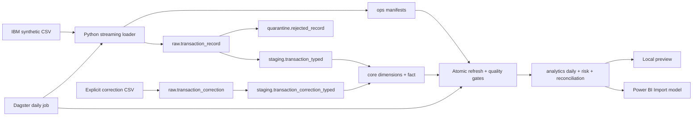

# Architecture decisions

The grain of the core fact is one accepted original raw record. Source data
contains no transaction ID, so `source_raw_record_id` is a local surrogate.
Exact payload matches are held as duplicate candidates rather than silently
merged. Corrections require an explicit target raw ID and append to a separate
immutable event log. The current fact points to the latest correction.

Ingestion uses file SHA-256 hashes and a manifest for replay safety. Promotion
uses ingestion IDs, not event timestamps, as cursors. Late events are included
regardless of date. Every promotion batch is one database transaction; the
watermark advances last. Analytics publication uses the same database-wide
advisory transaction lock and one transaction for mart refresh, reconciliation,
quality gates, and publication marker update.

Risk rules are simple and inspectable: top 1% amounts within a day and currency
when at least 100 transactions exist (2 points), five outgoing transactions in
one hour from the same account and currency (2 points), and three payments to
the same counterparty in one day and currency (1 point). Score ≥2 is an alert.
The synthetic laundering label is excluded from the score. These are workload
signals, not validated detection thresholds.

Money is stored as `numeric(24,6)`, and aggregates as `numeric(38,6)`.
The source contract permits six fractional digits for Bitcoin and two for other
currencies; no Bitcoin amount is rounded to cents. Amounts
are reconciled within each payment currency. The project does not add amounts
across currencies or assume a timezone. Both original and corrected totals are
retained in the reconciliation model.

The local stack is PostgreSQL 16 plus Dagster. PostgreSQL performs set-based
transformations and marts; Python handles file boundaries and orchestration.
dbt independently tests the published state. The architecture omits Kafka,
Spark, and a serving API because the input is a batch CSV and the consumers
query curated PostgreSQL data directly.
