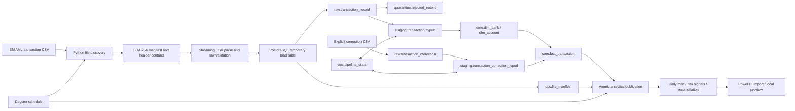

# Banking Transaction Data Pipeline & Analytics Platform

This area implements Parts 1–7 and the reproducible preview/documentation portion
of Part 8: ingestion, validation, a typed banking model, incremental promotion,
analytics with reconciliation, and orchestration. A native Power BI report is
still a handoff item; the local preview is not presented as one. This pipeline
is separate from the older investigation and modeling workflow in the root.

## Architecture



Every parsed row is retained in `raw.transaction_record`, including invalid rows.
`validation_status` is `accepted`, `rejected`, or `duplicate_candidate`.
Invalid rows and exact-payload duplicate candidates are also indexed in
`quarantine.rejected_record` with reason codes and original line text.

The loader streams CSV rows into a PostgreSQL temporary table using `COPY`.
Classification and insertion are set based. A file either commits fully or rolls
back its rows; the manifest records failures for retry. A completed SHA-256 hash
is skipped on rerun. Its source bytes and schema contract must remain stable.

## Dataset

Use IBM's synthetic Anti-Money Laundering transaction data, specifically the
`HI-Small_Trans.csv` variant. The [IBM source repository](https://github.com/IBM/AML-Data)
links to the distribution and states that the data itself uses CDLA-Sharing-1.0.
Place the file in `data/raw/`; it is intentionally Git-ignored. The small fabricated
fixture at `tests/fixtures/pipeline_transactions.csv` is safe to commit and only
used for testing.

Run the fixture first, then the full source. The full HI-Small export is several
million rows and needs adequate local PostgreSQL disk space. The promotion path
uses bounded batches and was smoke-tested with 200,000 generated transactions;
the full-source throughput has not been benchmarked. The local test was stopped
because the machine had limited free disk space.

## Run locally

Requirements: Docker with Compose, and Python 3.10 or newer.

```sh
docker compose up -d postgres
python3 -m venv .venv
source .venv/bin/activate
python -m pip install -e ".[dev,orchestration,dbt]"
PYTHONPATH=src python -m banking_pipeline.ingest tests/fixtures/clean_pipeline_Trans.csv
PYTHONPATH=src python -m banking_pipeline.ingest tests/fixtures/clean_pipeline_Trans.csv
PYTHONPATH=src python -m banking_pipeline.promote --all
PYTHONPATH=src python -m banking_pipeline.analytics
```

The second invocation should report `"status": "skipped"`; publication should
report `"status": "published"`. The separate
`tests/fixtures/pipeline_transactions.csv` deliberately contains rejects and
duplicate candidates for quality-gate tests. To load the full file:

```sh
PYTHONPATH=src python -m banking_pipeline.ingest data/raw/HI-Small_Trans.csv
```

Pass a directory to discover `*Trans.csv` files in sorted filename order, or set
`--pattern` explicitly. The loader rejects any file whose header is not the
versioned IBM transaction contract. It does not import account files.
`--batch-size` changes progress-log frequency;
PostgreSQL still performs one atomic load per file.

The Compose service initializes `ops`, `raw`, `quarantine`, `staging`, `core`, and `analytics`
on a fresh volume.
The preexisting `sql/schema.sql` belongs to the older investigation workflow and
is not used by this loader. If a volume already existed before the new SQL was
added, apply the five versioned SQL files in `pipeline/sql/` in numeric order
to that database with `psql -v ON_ERROR_STOP=1 -f <file>`.

Inspect a run:

```sh
docker compose exec postgres psql -U banking -d banking_pipeline -c \
  "SELECT file_id, status, total_rows, accepted_rows, rejected_rows, duplicate_candidates FROM ops.file_manifest ORDER BY file_id;"
docker compose exec postgres psql -U banking -d banking_pipeline -c \
  "SELECT source_row_number, reason_codes, raw_text FROM quarantine.rejected_record ORDER BY rejection_id LIMIT 20;"
```

Connection settings can be overridden with `BANKING_DATABASE_URL`. Compose uses
the independent `BANKING_POSTGRES_*` variables shown in `.env.example`, so the
existing investigation database settings do not change this service. The local
password is a development default only.

## Source data dictionary

The CSV has two columns named `Account`; their positions identify the sender and
receiver. The raw JSON payload uses distinct keys.

| CSV column | Raw JSON key | Meaning / validation |
| --- | --- | --- |
| Timestamp | `timestamp` | Source event time; no supplied timezone; accepted as `YYYY/MM/DD HH:MM` or `YYYY-MM-DD HH:MM:SS` |
| From Bank | `from_bank` | Sender bank identifier; required text |
| Account (first) | `from_account` | Sender account identifier; required text, leading zeros preserved |
| To Bank | `to_bank` | Receiver bank identifier; required text |
| Account (second) | `to_account` | Receiver account identifier; required text |
| Amount Received | `amount_received` | Decimal amount; nonnegative and at most two fractional digits |
| Receiving Currency | `receiving_currency` | Required source currency code; canonical codes come in later staging |
| Amount Paid | `amount_paid` | Decimal amount; nonnegative and at most two fractional digits |
| Payment Currency | `payment_currency` | Required source currency code |
| Payment Format | `payment_format` | Required source payment method |
| Is Laundering | `is_laundering` | Synthetic answer-key label, `0` or `1` |

All raw JSON values remain source strings. Decimal conversion and business
modeling happen during promotion; source currency names remain unchanged.
`record_hash`
is SHA-256 of normalized JSON field names and trimmed values, not a transaction
identifier supplied by IBM.

## Typed model and incremental promotion

Run after ingestion:

```sh
PYTHONPATH=src python -m banking_pipeline.promote --all
```

Each promotion call processes at most 100,000 accepted raw rows and 10,000
correction events by default. `--all` repeats until caught up; `--raw-limit`
and `--correction-limit` adjust batch sizes. The database performs each batch
atomically. The raw and correction ID cursors advance only after staging,
dimensions, facts, and count reconciliation commit. A failed batch leaves the
cursors unchanged and can be rerun.

The source has no timezone. `event_time` is a PostgreSQL `timestamp without time
zone`; the model does not claim UTC. Bank codes and account codes remain text to
preserve leading zeros. Bank identity is `bank_code`; account identity is the
pair `(bank_code, account_code)`. Both received and paid amounts retain their
source currency, so no unverified currency conversion or combined volume is
introduced. The laundering label remains a synthetic answer key.

| Table | Grain / key | Purpose |
| --- | --- | --- |
| `staging.transaction_typed` | One accepted raw row; `raw_record_id` | Casted, source-aligned transaction |
| `staging.transaction_correction_typed` | One correction event; `correction_id` | Typed correction history |
| `core.dim_bank` | One source bank code | Bank surrogate key |
| `core.dim_account` | One bank/account code pair | Account surrogate key |
| `core.fact_transaction` | One original raw transaction; `source_raw_record_id` unique | Current canonical transaction, with optional latest correction ID |
| `ops.pipeline_state` | One promotion pipeline | Raw/correction ID cursors and maximum observed event time |
| `ops.promotion_run` | One completed batch | Ranges, counts, late-arrival and correction metrics |
| `ops.promotion_failure` | One failed attempt | Error and requested replay bounds, written after rollback when the database is reachable |

The cursor uses ingestion IDs, not transaction time. If tomorrow's file contains
an older transaction, it is still loaded and reported in `late_arriving_rows`.
`max_event_time` is an observed-time metric only. This avoids dropping late
events through an event-time filter. The loader and promoter share an advisory
transaction lock so an uncommitted lower ID cannot appear after the cursor
advances.

To replay a historical ID interval without moving the live cursors:

```sh
PYTHONPATH=src python -m banking_pipeline.promote --mode backfill \
  --raw-after 0 --raw-through 100000
```

The interval is exclusive/inclusive. Backfill is idempotent and fills missing
derived rows; it does not replace an existing corrected fact with the original
source event. Use explicit correction ranges when replaying correction events:
`--correction-after 0 --correction-through 100`.

## Explicit corrections

IBM does not supply a durable transaction ID. An amended row cannot be inferred
reliably from a changed amount or timestamp. A correction therefore names the
original `raw_record_id` explicitly. The correction CSV header is `Target Raw
Record ID` followed by the eleven original transaction columns, in order. Each
correction row contains a complete replacement transaction, not a partial patch.
Find the target ID using `core.fact_transaction.source_raw_record_id`.

```text
Target Raw Record ID,Timestamp,From Bank,Account,To Bank,Account,Amount Received,Receiving Currency,Amount Paid,Payment Currency,Payment Format,Is Laundering
```

```sh
PYTHONPATH=src python -m banking_pipeline.corrections data/raw/corrections.csv
PYTHONPATH=src python -m banking_pipeline.promote --all
```

Correction files have independent SHA-256 manifests and are skipped on exact
rerun. The original raw row and typed staging row remain unchanged. Corrections
append to `raw.transaction_correction`, then the latest correction ID updates
the canonical fact in place. The fact retains `current_correction_id` for audit.
An invalid correction file fails atomically; no partial corrections are applied.

Useful checks:

```sql
SELECT last_raw_record_id, last_correction_id, max_event_time
FROM ops.pipeline_state WHERE pipeline_name = 'transaction_promotion';

SELECT promotion_run_id, raw_from_exclusive, raw_to_inclusive,
       fact_inserted_rows, correction_events, late_arriving_rows
FROM ops.promotion_run ORDER BY promotion_run_id DESC LIMIT 10;

SELECT f.transaction_key, f.event_time, f.amount_paid, f.payment_currency,
       fb.bank_code AS from_bank, fa.account_code AS from_account,
       tb.bank_code AS to_bank, ta.account_code AS to_account,
       f.current_correction_id
FROM core.fact_transaction f
JOIN core.dim_account fa ON fa.account_key = f.from_account_key
JOIN core.dim_bank fb ON fb.bank_key = fa.bank_key
JOIN core.dim_account ta ON ta.account_key = f.to_account_key
JOIN core.dim_bank tb ON tb.bank_key = ta.bank_key
ORDER BY f.transaction_key DESC LIMIT 10;
```

## Published analytics and reconciliation

Run `python -m banking_pipeline.analytics` after promotion. The PostgreSQL
publication function refreshes affected event dates, computes transparent risk
rules and daily aggregates, reconciles file-level counts and paid amounts by
currency, and advances the publication marker in one transaction. If a gate
fails, marts and marker remain at the previous publication. The risk table
stores a snapshot of displayed transaction fields, so a correction promoted to
`core` cannot leak into an older published alert view after a failed gate.

| Reporting object | Grain / purpose |
| --- | --- |
| `analytics.fact_daily_transaction` / `v_daily_metrics` | Event date × sender bank × payment currency × payment format; counts, paid amount, synthetic labels, alert counts |
| `analytics.fact_risk_signal` / `v_risk_alert` | One published transaction; inspectable rule flags and score ≥2 alert view |
| `analytics.v_risk_evaluation` | Event date × currency; alert/label counts including missed synthetic labels |
| `analytics.file_row_reconciliation` | One source file; manifest → raw → staging → core counts |
| `analytics.file_amount_reconciliation` | One source file and payment currency; original raw/staging and effective corrected/core amounts |
| `analytics.publication_state` / `publication_run` | Published boundary and audit history |
| `analytics.v_pipeline_health` | Current publication, promotion cursor, and failures |

Amounts are never summed across currencies. Risk scores are illustrative
workload signals, not calibrated predictions. The synthetic `is_laundering`
label is excluded from score calculation. The default quality policy rejects
publication when a newly affected file has over 5% rejected rows; adjust only
after investigating and documenting a source exception.

## Automation, tests, and preview

`docker compose up -d --build` starts PostgreSQL and Dagster. The
`banking_daily_pipeline` job discovers source files, loads explicit corrections,
promotes until caught up, and publishes analytics. Its 2 AM Toronto schedule
starts **disabled**. See the [runbook](RUNBOOK.md) before enabling it.

Run independent checks after publication:

```sh
python -m pytest -q tests/test_banking_*.py
dbt test --project-dir pipeline/dbt --profiles-dir pipeline/dbt
```

The Python suite covers parsing, file idempotency, quarantine, incremental
promotion, corrections, reconciliation, failed-publication rollback, and
Dagster success/failure paths. The dbt suite tests the published database
independently. GitHub Actions runs both against PostgreSQL 16.

Export a bounded dashboard snapshot and open the local preview:

```sh
python -m banking_pipeline.export_dashboard
python -m http.server 8765 --directory pipeline/dashboard
```

Visit `http://localhost:8765`. The ignored `data.json` is derived from the
database; if absent, the page clearly labels its committed fabricated sample.
The preview is intentionally not a Power BI file. The [Power BI build kit](powerbi/README.md)
documents the import connection, model grain, pages, and measures; its native
report and screenshots remain unverified. See [architecture decisions](ARCHITECTURE.md)
and [benchmark](BENCHMARK.md) for reviewer-facing evidence.

## Quality and replay policy

- A header mismatch or unreadable file fails the file; no raw rows are committed.
- Wrong-width or malformed CSV lines and invalid required fields are retained as
  rejected raw rows and copied to quarantine.
- Exact matching payloads within or across files become `duplicate_candidate`.
  They remain in raw and quarantine because the source provides no durable
  transaction ID; two identical payments could be separate legitimate events.
- The manifest reconciles `total_rows = accepted_rows + rejected_rows +
  duplicate_candidates` and is updated in the same transaction as raw data.
- A failed file can be retried by rerunning the command. Its previous raw insert
  is rolled back. A completed file is skipped by SHA-256.
- Source line text, file hash, row number, and error codes make rejects traceable.

This remains a batch pipeline. Source-specific currency precision and a native
Power BI report are future extensions, not implemented claims.
