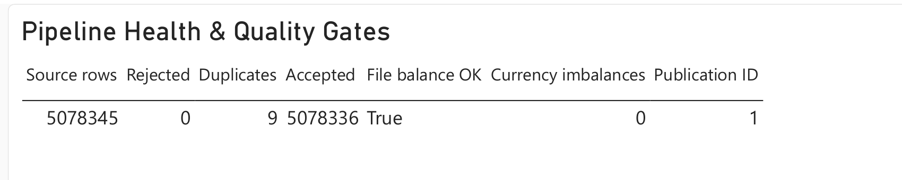
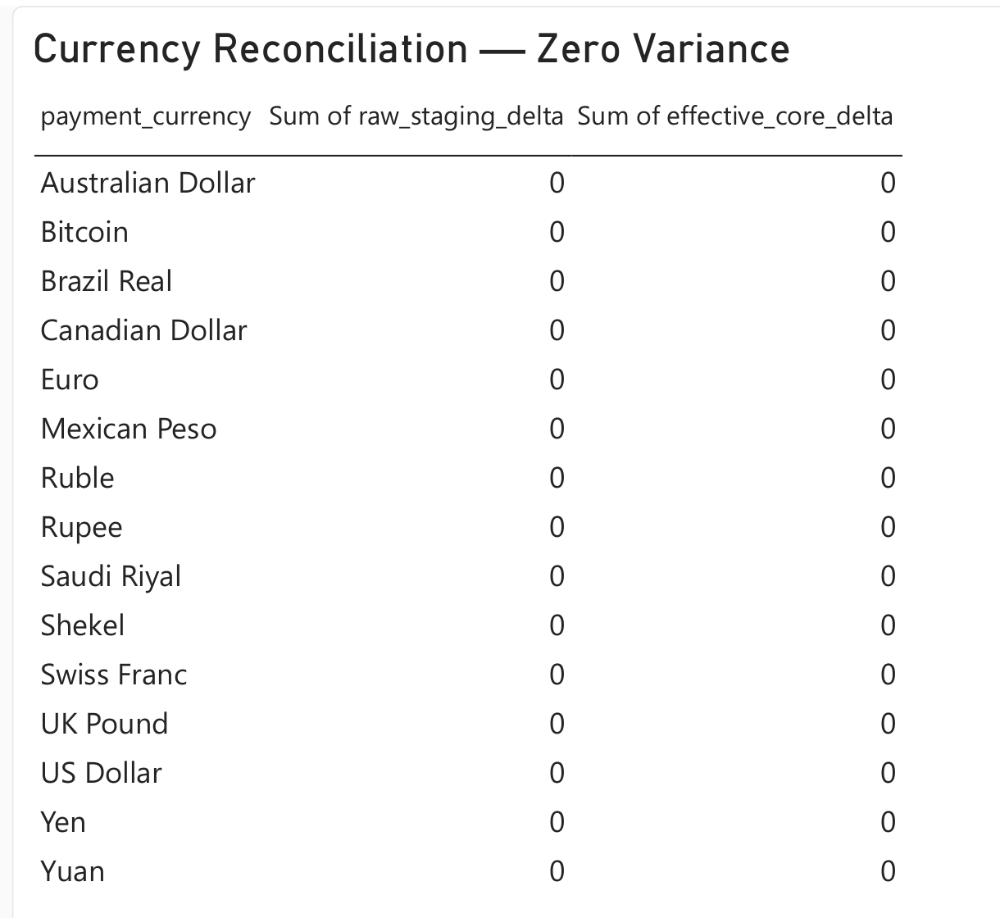
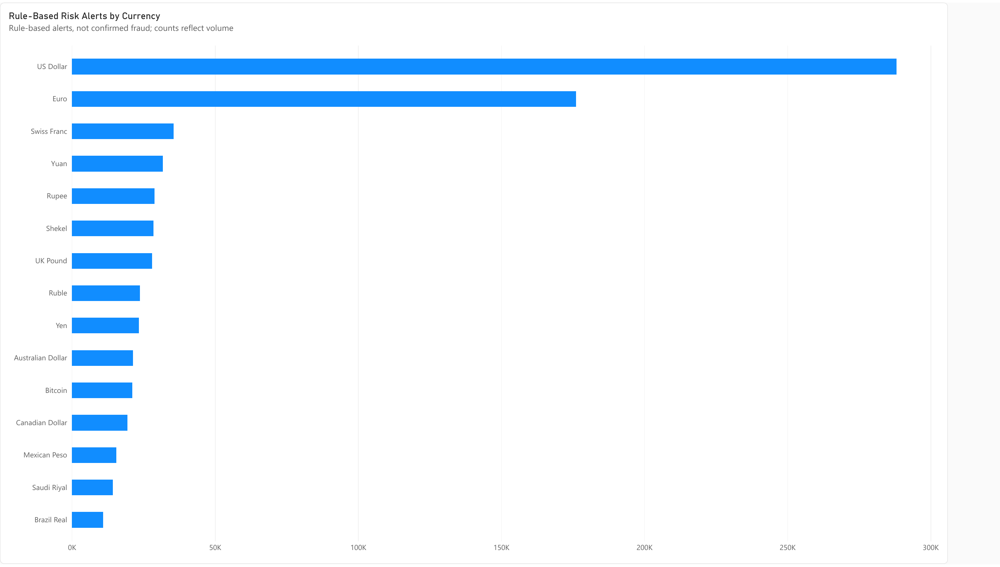

# Power BI report: Banking Transaction Pipeline Analytics

The [four-page report](https://app.powerbi.com/groups/0a05dc72-9fe5-4d16-9ad8-96d9a86f8c09/reports/11bcb2bd-eee1-4e92-8d16-6321df6267e6) was authored and saved in a private Power BI workspace. Download the [complete PDF export](banking-transaction-pipeline-analytics.pdf) or open any page image below without workspace access. A `.pbix` or `.pbip` source file has **not** been exported to this repository.

The report's semantic model was built from an Excel workbook exported from the verified full-source PostgreSQL publication (`banking_pipeline_fullrun`, publication ID 1). This is a **static snapshot**, not a live PostgreSQL connection or automatic refresh. The source workbook also contains a row-level alert sample with account identifiers, so it is not committed as public evidence. The authoritative counts and quality checks remain in [`../evidence/full_run.json`](../evidence/full_run.json); the report presents them visually.

| Saved page | What it shows | Evidence |
| --- | --- | --- |
| Transaction Activity | Daily published transaction counts and a rounded 5M summary card | [Screenshot](../screenshots/transaction-activity.png) |
| Pipeline Health | Source, accepted, rejected, and duplicate-candidate rows plus quality flags | [Screenshot](../screenshots/pipeline-health.png) |
| Reconciliation | Raw-to-staging and effective-core deltas by payment currency | [Screenshot](../screenshots/reconciliation.png) |
| Risk Monitoring | Rule-based alert counts by payment currency | [Screenshot](../screenshots/risk-monitoring.png) |

## Page images

Click an image for its full-size export.

| Transaction Activity | Pipeline Health |
| --- | --- |
|  |  |

| Reconciliation | Risk Monitoring |
| --- | --- |
|  |  |

The verified publication has **5,078,345 source rows**, **5,078,336 accepted rows**, **zero rejected rows**, and **nine exact-payload duplicate candidates**. Its file-row balance is true, all 15 displayed currency deltas are zero, and there are zero imbalanced currency groups. The 5M card is a display abbreviation, not the exact accepted-row count. The risk chart counts rule-based alerts; they are not confirmed fraud cases, fraud rates, or model probabilities.

These screenshots establish what was visible in the saved report at export time. They do not by themselves prove the underlying pipeline execution, future refresh behavior, or a live database connection. The separate [full-run evidence](../evidence/full_run.json) and [reproduction guide](../README.md) cover the pipeline checks.

## Future live-source connection

The repository includes [`M_queries.pq`](M_queries.pq) and [`Measures.dax`](Measures.dax) as a build kit for a future Desktop-authored report. They are **not** the source of the saved web report above. To replace the static Excel import with a PostgreSQL import, use Power BI Desktop's PostgreSQL connector with server `localhost:5432`, database `banking_pipeline_fullrun`, and Import mode when Desktop runs on the same computer as the verified full-run database. On another computer, `localhost` refers to that computer, so move or securely expose the database first. The example M queries default to the separate Docker development database (`localhost:5433`, `banking_pipeline`); update both values before using them for the full run.

Load the published `analytics` views and tables appropriate to each page, including `v_daily_metrics`, `v_risk_alert`, `file_row_reconciliation`, `file_amount_reconciliation`, `v_pipeline_health`, `v_risk_evaluation`, and `publication_state`. Keep bank and account identifiers as text, dates as dates, and event times as date/time. Bitcoin source amounts can have six decimal places; Power BI's fixed-decimal type has only four, so PostgreSQL-calculated reconciliation totals remain the authoritative exact values. Refresh only after `analytics.publication_state.published_at` changes. Keep daily aggregates and transaction-level alert samples at their own grains—do not join on bank code alone and multiply counts or amounts.

If this live-source version is built, save it as PBIP/PBIR so its source can be reviewed in Git. See [Microsoft's project-format documentation](https://learn.microsoft.com/en-us/power-bi/developer/projects/projects-overview) and [PostgreSQL connector documentation](https://learn.microsoft.com/en-us/power-query/connectors/postgresql).
